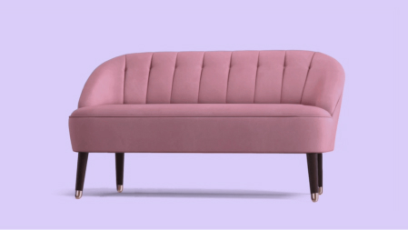

# 🛋️ Sofá Margot II - Rosé | Desafio #boraCodar da Rocketseat

Este é um projeto desenvolvido como parte do desafio **#boraCodar** da [Rocketseat](https://www.rocketseat.com.br/). O desafio consistia em criar uma página de produto com um visual moderno e interações animadas, como a rotação de um sofá em 360°.



## 🧠 Funcionalidade

- Página de exibição do **Sofá Margot II - Rosé**.
- Animação do sofá girando automaticamente em 360°.
- Ao clicar no botão "X", a rotação do sofá é pausada.
- Botão “Adicionar à cesta” com visual interativo.

## 🚀 Tecnologias Utilizadas

- HTML5
- CSS3
- JavaScript

## 📂 Como rodar o projeto

1. Clone o repositório:
   ```bash
   git clone https://github.com/seu-usuario/nome-do-repo.git
